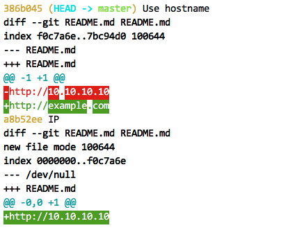

http://example.com

How the diff shows up with diffr as the pager:

The program seems to be skipping the dots in the URL for changes. This
sort of change works fine with the `diff-highlight` program.
